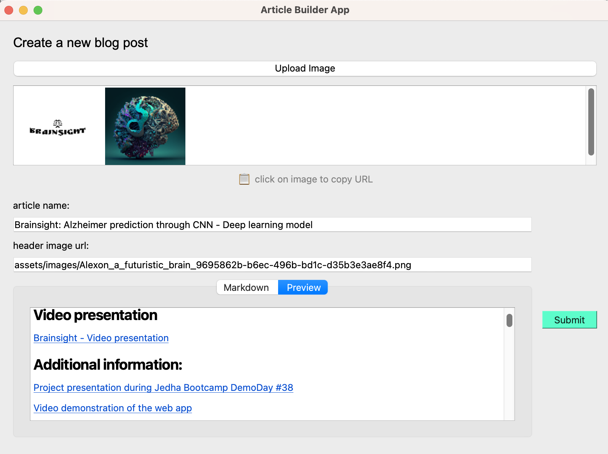

# blog-ualexon

Welcome to my tech-focused blog! This repository contains the source code for my personal blog, which I built using [Jekyll](https://jekyllrb.com/) and hosted on [GitHub Pages](https://pages.github.com/). The purpose of this blog is to share my thoughts and experiences on various tech topics, including data science, AI, software programming, tools and frameworks, and more.

## Getting started

This blog is built with a Minimal Jekyll theme for GitHub Pages [1].

[1] Jekyll theme "Minimal" for GitHub Pages: https://github.com/pages-themes/minimal (CC0 1.0 Universal License)

#### Article Builder App

The Article Builder App is a software tool designed for writers who want to create beautiful and engaging articles. It is built using **PyQt6** and **Markdown** technologies, and it provides a simple and intuitive interface that allows users to write their articles in Markdown format.




##### Features

The article builder app allows you to:

- Upload images and insert them into your article
- Preview your markdown code in real time
- Save your article as a markdown file

##### Setup

```bash
python3 -m venv env
pip3 install -r requirements.txt
source env/bin/activate
python3 article_builder.py
```

## Contributing

If you have suggestions, feedback, or ideas for new blog posts, feel free to open an issue or submit a pull request. I'm always looking for ways to improve my blog and welcome any contributions.

## License

This blog is licensed under the [MIT License](LICENSE). Feel free to use the code and content in this repository for your own personal projects or blogs. If you use any of my content, please give credit and link back to my blog.

---

## Sources

- [Github pages](https://pages.github.com/)
- [Example - Jekyll Minimal theme](https://github.com/mattschapman/mattschapman.github.io)
- [Github pages with Jekyll](https://docs.github.com/fr/pages/setting-up-a-github-pages-site-with-jekyll/creating-a-github-pages-site-with-jekyll)