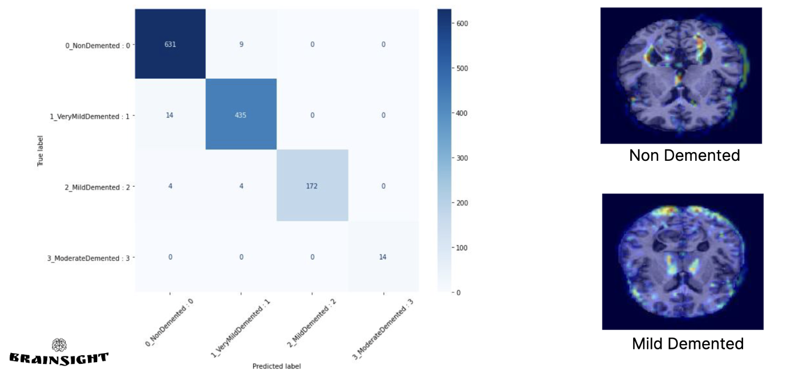
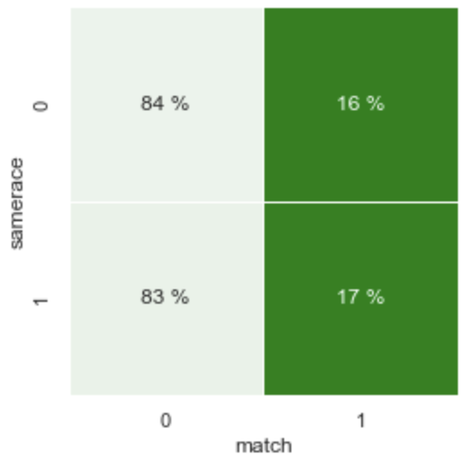
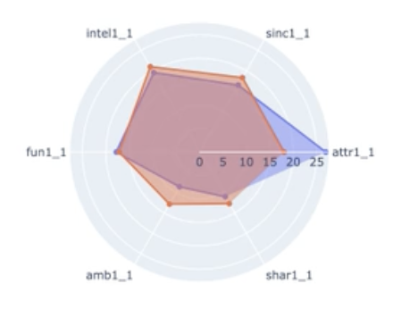
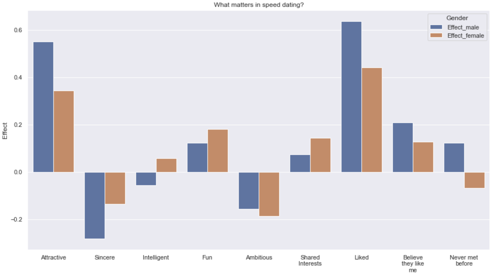
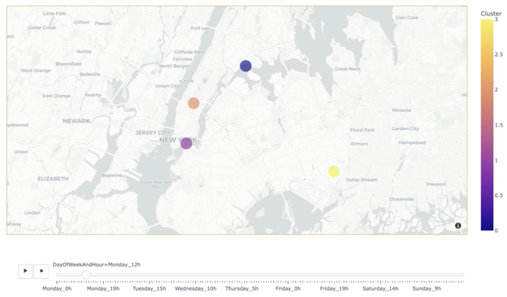

## Recent posts

---

### [Brainsight: deep learning model for predicting Alzheimer's disease using MRIs]()

Alzheimer's Disease is a progressive brain disorder that affects millions of people worldwide. Early detection and diagnosis of Alzheimer's is critical for effective treatment and care. The BrainSight project demonstrated the power of deep learning and MRI imaging in predicting Alzheimer's disease. The CNN model achieved high sensitivity and specificity, indicating its potential as a diagnostic tool for early detection and diagnosis of Alzheimer's.

  

    
<small><b>Figure 1</b>: Model evaluation</small>

    
  

     

[View code on Github](https://github.com/Alexon1999/brainsight)

---

### [Let's go find out, What gets people a second date?]()

If you're curious about what it takes to get a second date, look no further than the speed dating dataset on [Kaggle](https://www.kaggle.com/datasets/annavictoria/speed-dating-experiment). In this article, we'll analyze the data to identify the factors that contribute to getting a second date, including physical attractiveness, shared interests, and more. By exploring the impact of various factors on dating success, we'll provide insights that can help individuals improve their chances of finding love.

  

    

      
<small><b>Figure 1</b>: Is it important to belong to the same human race</small>

      
    

    

      
<small><b>Figure 1</b>: Is it important to belong to the same human race</small>

      
    

  

  

    
<small><b>Figure 2</b>: What are the attributes that matter in the final decision</small>

    
  

       

[View code on Github](https://github.com/Alexon1999/speed-dating-eda)

---

### [Recommending Optimal Zones for Uber Drivers Using Clustering]()

The growth of ride-sharing services like Uber has revolutionized the transportation industry. Uber drivers face a challenge of deciding the best locations to be in at different times of the day to maximize their profits. This project aims to use clustering techniques to analyze pickup data and recommend optimal zones for Uber drivers at different times of the day.

  

    
<small><b>Figure 1</b>: Hot-zones per hour and per day of week</small>

    
  

      

[View code on Github](https://github.com/Alexon1999/uber-pickup-analysis)

---

## Skills-based projects
A selection of smaller projects demonstrating specific programming, data science and ML skills.

- [Extract insights through Exploratory Data Analysis (EDA) ](https://github.com/Alexon1999/speed-dating-eda)
- [Kayak's Data-Driven Approach: Web Scraping, Cloud-Based Data Storage, ETL and Data Analysis for Finding the Best Hotels and Hottest Travel Destinations](https://github.com/Alexon1999/kayak)
- [Solving complex problems with Machine Learning: A Dual Approach with Supervised and Unsupervised Learning](https://github.com/Alexon1999/Bloc_3)
- [The Power of Deep Learning: Solving Complex Problems with Neural Networks](https://github.com/Alexon1999/spam-detector)
- [Deploying Machine Learning Models in Production: Best Practices and Tools](https://github.com/Alexon1999/getaround)